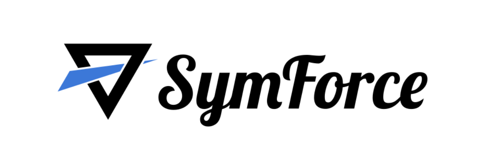
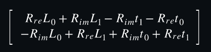
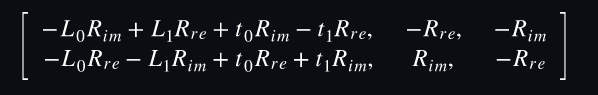
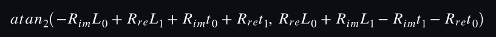
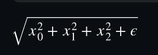
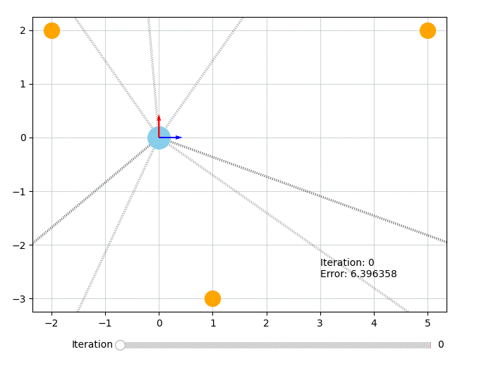

<h1 align="center">SymForce</h1>


SymForce merupakan sebuah code generation library yang digunakan untuk komputasi simbolik cepat dan sering digunakan untuk pengaplikasian metode robotik. Pada umumnya Symforce akan mengkombinasikan development speed dan fleksibelitas simbolik dalam matematika dengan performa yang autogenerated. Untuk implementasi akan lebih optimal menggunakan bahasa pemrograman C++ atau bahasa pemrograman yang memiliki runtime yang cepat. Berikut adalah beberapa contoh pengaplikasian yang dapat menggunakan SymForce :
- Computer Vision
- State Estimation
- Motion Planning
- Robot Controls

SymForce terdiri dari 3 sistem, yaitu :
- Symbolic Toolkit
- Code Generator
- Optimization Library


# Disclaimer
Untuk informasi dan Referensi apabila terjadi ERROR dapat melakukan pengecekan pada source berikut :

- Source Code Github : `https://github.com/symforce-org/symforce`.
Hal ini dikarenakan pemanggilan function dan method terdapat pada beberapa path yang telah ada dan penulis hanya melakukan overview dokumentasi.

<h1 align="center">Build</h1>

Tools and Compatible Version Language
- Python 3.8+ 
- C++14
- CMake

<h1 align="center">Features</h1>
- Dapat mengimplementasikan simbolik geometri dan juga tipe kamera dengan menggunakan operasi Lie Group
- Dapat meminimalkan bug, mengurangi duplikasi serta pembuatan code generation dengan runtime yang cepat.
- Dapat melakukan komputasi untuk menghitung Tangent Space-Jacobian dengan optimal
- Memiliki flattening computation dan memanfaatkan sparsity yang dapat menghasilkan 10x percepatan apabila dibandingkan dengan autodiff standar
- Termasuk ke dalam Tangent-space Optimization library tercepat berdasarkan grafik faktor untuk bahasa pemrograman C++ dan Python


<h1 align="center">:desktop_computer: Instalisasi :desktop_computer:</h1>

Install menggunakan pip :

```sh
pip install symforce
```
Untuk memudahkan instalisasi bisa melihat requirements.txt : `data/requirements.txt`.

Kemudian untuk verifikasi hasil instalisasi dengan Python

```sh
>>> import symforce.symbolic as sf
>>> sf.Rot3()
```

<h1 align="center">Implementasi SymForce </h1>

Contoh Studi Kasus#
Robot bergerak melalui bidang 2D dan memiliki goal untuk memperkirakan pose pada beberapa langkah kedepan dengan sebuah pengukuran kebisingan (noisy measurements). 

Pengukuran yang harus dilakukan oleh Robot :

 * Jarak yang ditempuh dengan menggunakan sensor odometri
 * Sudut relatif menuju landmark.

Berdasarkan kasus di atas, maka robot memiiki sudut dengan tujuan yang berlawanan arah jarum jam dari sumbu x. Oleh karena itu, pengukuran sudut relatif ditentukan dari arah robot akan maju. Berikut adalah gambar berdasarkan kasus robot yang kita miliki :


<h1 align="center">Perhitungan matematika</h1>

Hal pertama yang harus kita lakukan adalah melakukan import librari symforce yang berisikan API SymPy dan untuk kasus ini kita akan menggunakan symbolic untuk dapat mengimplementasikan kasus di atas:
```python
import symforce.symbolic as sf
```

Kemudian kita dapat membuat sebuah simbolik pose 2D serta pembuatan lokasi landmark. Pada bagian ini, kita dapat menggunakan method symbolic dari symforce.
```python
pose = sf.Pose2(
    t=sf.V2.symbolic("t"),
    R=sf.Rot2.symbolic("R")
)
landmark = sf.V2.symbolic("L")
```

Pada bagian selanjutnya kita dapat melakukan transformasi landmark ke dalam frame lokal dari robot. Untuk memrepresentasikan pose dari robot, kita menggunakan nama variabel `world_T_body`. Nama variabel dapat diganti sesuai dengan kebutuhan dari pengguna.
```python
landmark_body = pose.inverse() * landmark
```


Untuk kasus diatas, kita dapat melihat bahwa `sf.Rot2` direpresentasikan secara internal berdasarkan angka yang kompleks `(𝑅𝑟𝑒, 𝑅𝑖𝑚)`. Oleh karena itu, kita dapat melakukan analisa bagaimana hal tersebut melakukan rotasi terhadap landmark 𝐿.

Kita dapat menggunakan metode jacobian dari landmark body-frame dengan pendekatan tangent space dari `Pose2`, sehingga diparameterisasi dengan simbol (𝜃, 𝑥, 𝑦) :

```python
landmark_body.jacobian(pose)
```


##### NOTE : Walaupun orientasi pengaplikasian adalah sebuah angka-angka yang kompleks, tetapi metode tangent space merupakan sebuah sudut scalar dan hal ini dapat membuat SymForce dapat mengerti untuk melakukan execute code program.


Kemudian kita dapat melakukan komputasi sudut relatif bearing :

```python
sf.atan2(landmark_body[1], landmark_body[0])
```


Pada bagian ini, sebagai catatan `atan2` merupakan sebuah singular dengan koordinat (0, 0). Dengan menggunakan SymForce kita dapat mengatasi ini dengan menambahkan simbol ϵ (epsilon) untuk mempertahankan nilai ekspresi dalam batas ` ϵ → 0 `, tetapi nilai evaluasi saat runtime dapat menghasilkan nonzero yang sangat kecil.

Functions dengan singularitas yang menerima argumen `epsilon` :

```python
sf.V3.symbolic("x").norm(epsilon=sf.epsilon())
```


Untuk informasi lebih lanjut perihal Epsilon, dapat menelusuri link berikut : [Epsilon](https://symforce.org/tutorials/epsilon_tutorial.html)

<h1 align="center">Pembuatan optimalisasi masalah</h1>

Kita akan melakukan pemodelan untuk kasus ini ke dalam sebuah factor graph dan menyelesaikannya dengan nonlinear least-squares.

Tahap pertama, kita harus memberitahu SymForce untuk menggunakan nonzero epsilon dalam pencegahan singularitas. Hal penting yang harus kita ketahui pada bagian ini adalah mengevaluasi secara numerikal untuk beberapa output.

```python
import symforce
symforce.set_epsilon_to_symbol()
```

Ketika epsilon sudah terdefinisi, kemudian kita dapat mencoba numerical value dan juga dapat mencoba unknown poses (dapat diatur ke dalam identity)
Link referensi untuk numerical value : [`Values`](https://symforce.org/api/symforce.values.values.html?highlight=values#module-symforce.values.values)

```python
import numpy as np
from symforce.values import Values

num_poses = 3
num_landmarks = 3

initial_values = Values(
    poses=[sf.Pose2.identity()] * num_poses,
    landmarks=[sf.V2(-2, 2), sf.V2(1, -3), sf.V2(5, 2)],
    distances=[1.7, 1.4],
    angles=np.deg2rad([[145, 335, 55], [185, 310, 70], [215, 310, 70]]).tolist(),
    epsilon=sf.numeric_epsilon,
)
```

Setelah itu kita dapat mengatur faktor yang menghubungkan variabel-variabel yang kita gunakan. Pada bagian ini, fungsi residual terdiri dari 2 istilah, yaitu :
- Pengukuran sudut bearing
- Pengukuran odometri

Kemudian kita dapat memformalisasikan perhitungan matematikan yang telah kita defenisikan untuk perhitungan bearing ke dalam function symbolic residual:

```python
def bearing_residual(
    pose: sf.Pose2, landmark: sf.V2, angle: sf.Scalar, epsilon: sf.Scalar
) -> sf.V1:
    t_body = pose.inverse() * landmark
    predicted_angle = sf.atan2(t_body[1], t_body[0], epsilon=epsilon)
    return sf.V1(sf.wrap_angle(predicted_angle - angle))
```

Function ini akan mengambil variabel pose, landmark dan juga mengembalikan error yang diperoleh dari prediksi sudut bearing serta memberikan nilai dari hasil perhitungan. 

Optional : Kita dapat memanggil `sf.wrap_angle` untuk mengatasi wraparound effects.

Berikut adalah nilai residual untuk jarak yang ditempuh dan telah disederhanakan :

```python
def odometry_residual(
    pose_a: sf.Pose2, pose_b: sf.Pose2, dist: sf.Scalar, epsilon: sf.Scalar
) -> sf.V1:
    return sf.V1((pose_b.t - pose_a.t).norm(epsilon=epsilon) - dist)
```

Kita dapat membuat object [`Factor`](https://symforce.org/api/symforce.opt.factor.html?highlight=factor#module-symforce.opt.factor) dari function residual dan dapat menentukan keys sesuai kebutuhan. Untuk penamaan `key` akan berjenis strings untuk function arguments yang dimana dapat diakses dari class [`Values`](https://symforce.org/api/symforce.values.values.html) dan 

```python
from symforce.opt.factor import Factor

factors = []

# Bearing factors
for i in range(num_poses):
    for j in range(num_landmarks):
        factors.append(Factor(
            residual=bearing_residual,
            keys=[f"poses[{i}]", f"landmarks[{j}]", f"angles[{i}][{j}]", "epsilon"],
        ))

# Odometry factors
for i in range(num_poses - 1):
    factors.append(Factor(
        residual=odometry_residual,
        keys=[f"poses[{i}]", f"poses[{i + 1}]", f"distances[{i}]", "epsilon"],
    ))
```

Berikut adalah visualisasi struktur dari factor graph :


<h1 align="center">Penyelesaian Masalah</h1>

Tujuan kita dapat untuk menemukan `poses` dari robot yang meminimalkan residual dari factor graph, kemudian kita asumsikan posisi landmark ke dalam bentuk yang dapat dicermati dengan baik. Oleh karena itu, kita dapat membuat sebuah [`Optimizer`](https://symforce.org/api/symforce.opt.optimizer.html?highlight=optimizer#module-symforce.opt.optimizer) untuk faktor yang telah ada dan melakukan optimalisasi terhadap pose keys (sisanya akan dianggap sebagai nilai konstan).
```python
from symforce.opt.optimizer import Optimizer

optimizer = Optimizer(
    factors=factors,
    optimized_keys=[f"poses[{i}]" for i in range(num_poses)],
    # So that we save more information about each iteration, to visualize later:
    debug_stats=True,
)
```

Kemudian kita dapat run hasil dari optimalisasi [`Optimizer.Result`](https://symforce.org/api/symforce.opt.optimizer.html?highlight=optimizer#symforce.opt.optimizer.Optimizer.Result). Pada bagian ini akan berisi nilai optimalisasi, statistik error dan juga iterasi debug stats (apabila digunakan).
```python
result = optimizer.optimize(initial_values)
```

Visualisasi pengoptimalan :
 * Bentuk lingkaran berwarna orange merepresentasikan `fixed landmarks`
 * Bentuk lingkaran biru merepresentasikan robot
 * Garis putus-putus merepresentasikan perhitungan bearing.

```python
from data.plotting import plot_solution
plot_solution(optimizer, result)
```


Source Code `data/2D_RobotLocalization.py`.
